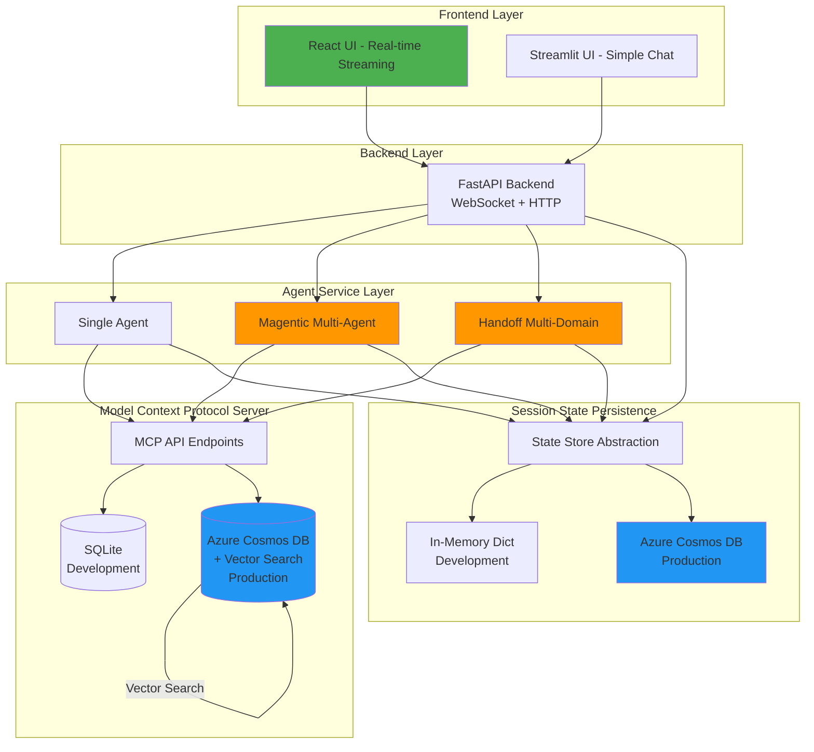
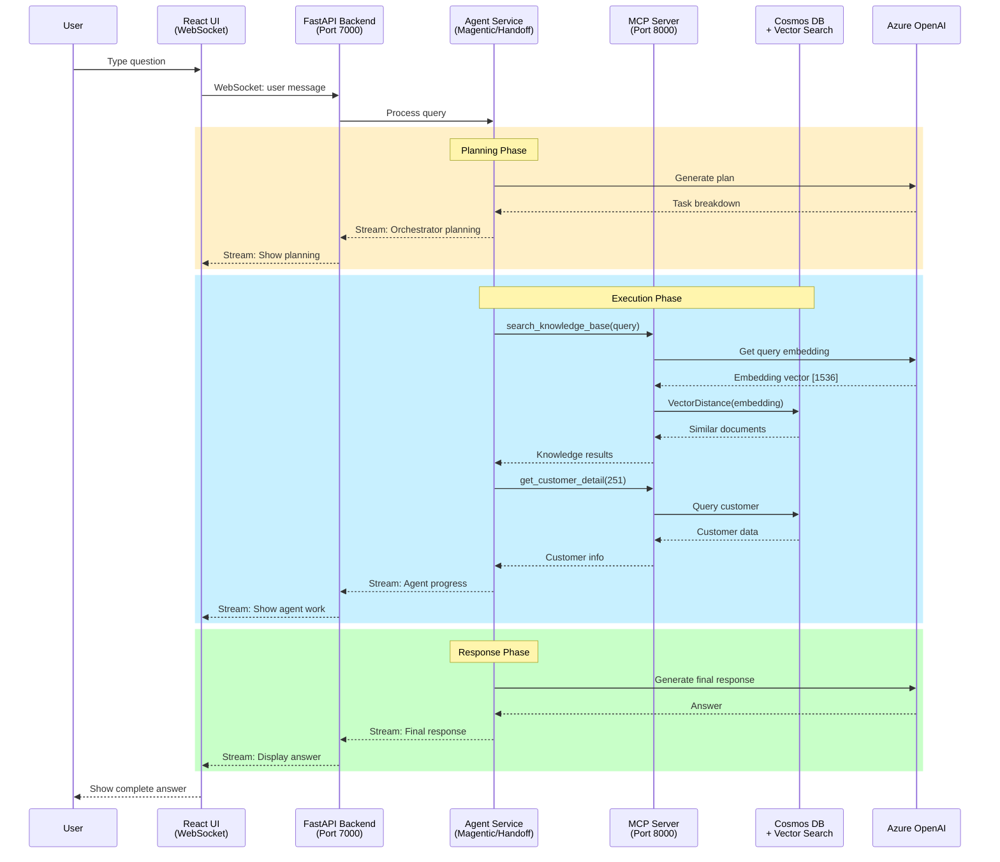
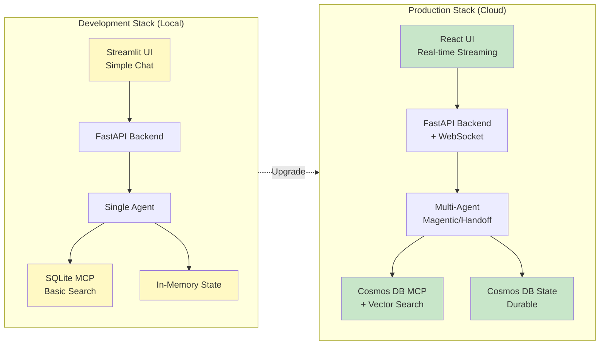

# System Architecture  

## Overview Diagram



This document outlines the architecture for the Microsoft AI Agentic Workshop platform. The architecture is modular and designed to support a wide variety of agent design patterns, allowing you to focus on agent implementation and experimentation without changing the core infrastructure.

**Key Design Principles:**
- 🔄 **Dual-mode operation**: Development (local, fast) and Production (cloud, scalable)
- 🎯 **Pluggable components**: Swap frontends, agents, and backends without code changes
- 🚀 **Production-ready**: Built-in support for vector search, streaming, and multi-tenancy

---

## Detailed Architecture Flow



---  
  
# High-Level OverviewThe system is organized into four primary layers plus a state-persistence component:  
  
- **Front End** – User-facing chat interface.  
- **Backend** – Orchestrates conversation flow, session routing, and mediates between the front end and agent logic.  
- **Agent Service Layer** – Loads, instantiates, and operates agent implementations (single-agent, multi-agent, multi-domain, etc.).  
- **Model Context Protocol (MCP) API Server** – Exposes structured business operations and tools via API endpoints for agent use.  
- **Agent State Persistence** – Stores per-session memory and conversation history, backed by either an in-memory Python dict (default) or an Azure Cosmos DB container for durable storage.  
  
**Supporting databases include:**  
- **SQL Database** – Core business/transactional data (customers, subscriptions, invoices, etc.).  
- **Vector Database** – Embedding-based semantic retrieval over internal documents and knowledge.  
  
---

## Development vs Production Architecture



**Quick Comparison:**

| Feature | Development | Production |
|---------|-------------|------------|
| Setup Time | 2 minutes | 15 minutes |
| Cost | Free | ~$1-2/day |
| Vector Search | Basic Python | Native diskANN |
| Persistence | Ephemeral | Durable |
| Scalability | Single user | Multi-user |
| UI Visibility | Basic | Full streaming |
| Dependencies | Python only | Python + Node + Azure |

---

# Component Breakdown## 1. Frontend  

### React UI (Recommended for Production)

**Technology:** React 18+ with Material-UI, WebSocket streaming

**Functionality:**
- **Split-panel interface**: Chat on right, internal agent process on left
- **Real-time streaming**: See orchestrator planning and agent execution live
- **Collapsible sections**: Expand/collapse orchestrator and individual agent outputs
- **Tool call visualization**: Track MCP tool invocations in real-time
- **WebSocket connection**: Low-latency bidirectional communication
- **Responsive design**: Works on desktop, tablet, and mobile

**Why React?**
- ✅ Full visibility into multi-agent orchestration and handoffs
- ✅ Real-time streaming of agent thinking process
- ✅ Professional UI/UX for production deployments
- ✅ Better for demos and showcasing agent capabilities
- ✅ Extensible component architecture

**Setup:**
```bash
cd agentic_ai/applications/react-frontend
npm install
npm start  # Opens at http://localhost:3000
```

📚 **[See React UI documentation →](agentic_ai/applications/react-frontend/README.md)**

---

### Streamlit UI (Alternative for Quick Testing)

**Technology:** Streamlit (Python)

**Functionality:**
- Simple interactive chat interface
- Persistent session per user
- Basic chat history display
- HTTP-based communication with backend

**Why Streamlit?**
- ✅ No Node.js required - pure Python
- ✅ Faster setup for simple testing
- ✅ Good for basic Q&A scenarios
- ❌ No real-time streaming visibility
- ❌ Limited visibility into agent orchestration

**Setup:**
```bash
cd agentic_ai/applications
uv run streamlit run frontend.py  # Opens at http://localhost:8501
```

**Recommendation:** Use React for Microsoft Agent Framework patterns to see full orchestration. Use Streamlit for quick single-agent testing.  
  
---  
  
## 2. Backend  
  
**Technology:** FastAPI (asynchronous Python)  
  
**Responsibilities:**  
- Exposes HTTP API endpoints for frontend communication.  
- Routes requests to the appropriate agent instance in the Agent Service layer.  
- Mediates agent tool calls to the MCP API server.  
- Persists session data and chat history via the Agent State Persistence component.  
  
**Endpoints:**  
- `/chat` – Processes chat requests and returns agent responses.  
- `/reset_session` – Clears session memory and context state.  
- `/history/{session_id}` – Retrieves conversation history.  
  
---  
  
## 3. Agent Service Layer  
  
**Design:** Pluggable and modular—enables loading different agent design patterns via the `AGENT_MODULE` environment variable.

### Available Patterns

#### Single Agent (`agents.agent_framework.single_agent`)

**Best for:** Simple conversational AI, Q&A, single-domain tasks

- Direct MCP tool integration
- Session-based memory
- Streaming support
- Good for straightforward customer service scenarios

#### Magentic Multi-Agent (`agents.agent_framework.multi_agent.magentic_group`)

**Best for:** Complex workflows, research, multi-step coordination

- Orchestrator-based planning and coordination
- Multiple specialist agents working simultaneously
- Progress tracking and replanning
- Checkpoint-based resume capability
- Full streaming visibility of orchestration

**Use when:** Tasks require planning, multiple domains, or complex coordination

#### Handoff Multi-Domain Agent (`agents.agent_framework.multi_agent.handoff_multi_domain_agent`)

**Best for:** Domain routing, specialized expert agents

- Intent classification for domain routing
- Seamless handoffs between specialist agents (Billing, Tech Support, Account Management)
- Context preservation across handoffs
- Optimized for clear domain boundaries

**Use when:** You have well-defined domains and need clean separation of concerns

### Capabilities
  
- **Tool invocation** via structured MCP API calls
- **Retrieval-Augmented Generation (RAG)** using vector knowledge base
- **Session memory** stored through Agent State Persistence component
- **Streaming responses** with internal process visibility (React UI)
- **Multi-turn conversations** with context retention
  
### Implementation
  
Built with [Microsoft Agent Framework](https://github.com/microsoft/agent-framework), leveraging:
- Azure OpenAI for LLM capabilities
- MCP protocol for standardized tool access
- WebSocket streaming for real-time updates

**Switch patterns by changing environment variable:**
```bash
# .env file
AGENT_MODULE=agents.agent_framework.multi_agent.magentic_group
```

📚 **[See Agent Framework patterns documentation →](agentic_ai/agents/agent_framework/README.md)**  
  
---  
  
## 4. Model Context Protocol (MCP) API Server  
  
**Technology:** FastAPI/asyncio, FastMCP framework, Pydantic for validation

**Purpose:** Provides realistic enterprise APIs for agent tool usage following the [Model Context Protocol](https://modelcontextprotocol.io/) standard.

### Deployment Modes

#### Development Mode (SQLite)

**Best for:** Local development, testing, learning, quick demos

- **Database:** SQLite with pre-populated sample data
- **Vector Search:** Basic similarity search
- **Setup Time:** < 1 minute
- **Cost:** Free
- **Performance:** Good for single-user scenarios

**Features:**
- 250+ customers with realistic data
- 9 deterministic test scenarios
- Knowledge base with embeddings
- No Azure dependencies

**Setup:**
```bash
cd mcp
uv sync
uv run python mcp_service.py  # Runs on http://localhost:8000
```

---

#### Production Mode (Azure Cosmos DB + Vector Search)

**Best for:** Production deployments, multi-user scenarios, cloud-native apps

- **Database:** Azure Cosmos DB NoSQL API (Serverless mode)
- **Vector Search:** Native `VectorDistance()` with diskANN indexing
- **Embeddings:** 1536-dimension vectors for semantic search
- **Authentication:** Azure AD (AAD) with RBAC - no keys in code
- **Setup Time:** 5-8 minutes (automated)
- **Cost:** ~$0.50-2.00/day (serverless, pay-per-use)

**Features:**
- ✅ **Native vector search**: Built-in `VectorDistance()` function for semantic similarity
- ✅ **Horizontal scalability**: Automatic partitioning and distribution
- ✅ **Multi-region replication**: Optional global distribution
- ✅ **Transaction support**: ACID guarantees for multi-document operations
- ✅ **Automatic backups**: Point-in-time restore capability
- ✅ **99.99% SLA**: Enterprise-grade availability
- ✅ **AAD authentication**: Secure, keyless access with Azure CLI credentials
- ✅ **Serverless mode**: Pay only for what you use

**Setup:**
```bash
cd mcp/data
.\setup_cosmos.ps1  # Automated: provision + RBAC + populate
cd ..
uv run python mcp_service_cosmos.py  # Runs on http://localhost:8000
```

**Architecture:**
- 12 containers with proper partition keys
- Vector embedding policy on KnowledgeDocuments
- Composite indexes for query optimization
- AAD-based RBAC (Cosmos DB Data Contributor role)

📚 **[See MCP setup documentation →](mcp/SETUP.md)**

---

### Key Endpoint Categories

**Customer Operations:**
- `get_all_customers` - List all customers
- `get_customer_detail` - Full profile with subscriptions
- `get_customer_orders` - Order history

**Billing & Finance:**
- `get_subscription_detail` - Subscription with invoices
- `get_billing_summary` - Current amount owed
- `get_invoice_payments` - Payment history
- `pay_invoice` - Record payment

**Account Management:**
- `update_subscription` - Modify plan, settings
- `unlock_account` - Security remediation
- `get_security_logs` - Audit trail

**Knowledge & Support:**
- `search_knowledge_base` - **Vector search** over policies/procedures
- `get_support_tickets` - Ticket history
- `create_support_ticket` - New ticket creation

**Data & Analytics:**
- `get_data_usage` - Usage metrics over date range
- `get_eligible_promotions` - Personalized offers

**All endpoints support:**
- Async/await for concurrency
- Structured JSON responses
- OpenAI function calling schema
- Authentication middleware (optional)  
  
---  
  
## 5. Agent State Persistence  

Separate from the MCP data layer, this component handles session memory and conversation history.

### Options

#### In-Memory Dict (Development)

**Best for:** Local development, testing, rapid iteration

- Fast, zero-configuration
- Ephemeral - data lost on process restart
- No external dependencies
- Good for single-user scenarios

#### Azure Cosmos DB (Production)

**Best for:** Production deployments, multi-user systems

- Durable, persistent storage
- Horizontally scalable
- Multi-tenant support with hierarchical partition keys (`/tenant_id/id`)
- Session recovery after restarts
- Audit trail and compliance

### Selection Logic
  
The system automatically detects Cosmos DB configuration and switches modes:

```python
# Auto-detection in backend.py
if os.getenv("COSMOSDB_ENDPOINT"):
    # Use Cosmos DB for state persistence
    state_store = CosmosDBStateStore()
else:
    # Fall back to in-memory dict
    state_store = InMemoryStateStore()
```

**Configuration:**
```bash
# .env file
COSMOSDB_ENDPOINT="https://your-account.documents.azure.com:443/"
# AAD auth is automatic via Azure CLI
```

### Used By
  
- **Backend** – Saves and fetches conversation history per session
- **Agent Service Layer** – Stores per-session memory, context, and checkpoints
- **Multi-Agent Orchestrators** – Persists planning state and agent handoff context

---

## Data Architecture Comparison

### Development Stack
```
Frontend: Streamlit (simple)
Backend: FastAPI
Agent: Single or multi-agent patterns
MCP Server: SQLite + basic search
State: In-memory dict
```

**Pros:** Fast setup, no cloud dependencies, free  
**Cons:** Limited scale, no vector search, ephemeral state

---

### Production Stack
```
Frontend: React (real-time streaming)
Backend: FastAPI + WebSocket
Agent: Multi-agent patterns (Magentic, Handoff)
MCP Server: Cosmos DB + native vector search
State: Cosmos DB (durable)
```

**Pros:** Enterprise-grade, scalable, vector search, durable  
**Cons:** Requires Azure subscription, ~$1-2/day cost

---

## Vector Search Deep Dive

### SQLite Mode (Development)

**Implementation:** Basic cosine similarity in Python
```python
# Similarity calculated in-memory
similarity = cosine_similarity(query_embedding, doc_embedding)
```

**Performance:** Good for < 1000 documents  
**Limitations:** No indexing, linear scan

---

### Cosmos DB Mode (Production)

**Implementation:** Native `VectorDistance()` SQL function with diskANN indexing

```sql
SELECT c.title, c.content, 
       VectorDistance(c.embedding, @queryEmbedding) AS SimilarityScore
FROM c
WHERE c.doc_type = 'policy'
ORDER BY VectorDistance(c.embedding, @queryEmbedding)
```

**Features:**
- ✅ **diskANN indexing**: Sub-millisecond vector search
- ✅ **Hybrid search**: Combine vector + metadata filters
- ✅ **1536-dimension embeddings**: text-embedding-ada-002 compatible
- ✅ **Auto-scaling**: Handles millions of documents
- ✅ **Multi-region**: Global low-latency search

**Performance:** < 10ms for vector queries, millions of documents

**Configuration:**
```json
{
  "vectorEmbeddingPolicy": {
    "vectorEmbeddings": [
      {
        "path": "/embedding",
        "dataType": "float32",
        "dimensions": 1536,
        "distanceFunction": "cosine"
      }
    ]
  },
  "indexingPolicy": {
    "vectorIndexes": [
      {
        "path": "/embedding",
        "type": "diskANN"
      }
    ]
  }
}
```

📚 **[Learn more about Cosmos DB vector search →](https://learn.microsoft.com/azure/cosmos-db/nosql/vector-search)**  
  
---  
  
# Deployment Decision Matrix

Choose the right configuration for your use case:

| Use Case | Frontend | Agent Pattern | MCP Backend | State Store | Setup Time |
|----------|----------|---------------|-------------|-------------|------------|
| **Quick Demo** | Streamlit | Single Agent | SQLite | In-Memory | 2 minutes |
| **Learning/Tutorial** | Streamlit | Any | SQLite | In-Memory | 5 minutes |
| **Multi-Agent Testing** | React | Magentic/Handoff | SQLite | In-Memory | 10 minutes |
| **Production Pilot** | React | Magentic/Handoff | Cosmos DB | Cosmos DB | 15 minutes |
| **Enterprise Production** | React | Magentic/Handoff | Cosmos DB | Cosmos DB | 20 minutes |

---

# Complete Setup Examples

## Example 1: Quick Local Demo

**Goal:** Test single agent with simple chat

```bash
# Terminal 1: MCP Server (SQLite)
cd mcp
uv sync
uv run python mcp_service.py

# Terminal 2: Backend
cd agentic_ai/applications
echo "AGENT_MODULE=agents.agent_framework.single_agent" > .env
uv sync
uv run python backend.py

# Terminal 3: Frontend
uv run streamlit run frontend.py
# Open http://localhost:8501
```

---

## Example 2: Full Production Stack

**Goal:** Production-ready system with vector search

```bash
# Step 1: Deploy Cosmos DB (one-time)
cd mcp/data
.\setup_cosmos.ps1  # Windows
# or
./setup_cosmos.sh   # Linux/macOS

# Terminal 1: MCP Server (Cosmos DB)
cd mcp
uv run python mcp_service_cosmos.py

# Terminal 2: Backend (with Cosmos state)
cd agentic_ai/applications
cat > .env << EOF
AGENT_MODULE=agents.agent_framework.multi_agent.magentic_group
COSMOSDB_ENDPOINT=https://mcp-contoso-cosmos.documents.azure.com:443/
EOF
uv run python backend.py

# Terminal 3: React Frontend
cd react-frontend
npm install
npm start
# Open http://localhost:3000
```

---

# Technology Stack Summary

## Frontend Technologies
- **React 18**: Modern UI framework
- **Material-UI**: Component library
- **WebSocket**: Real-time streaming
- **Streamlit**: Python-based simple UI

## Backend Technologies
- **FastAPI**: Async Python web framework
- **WebSocket**: Bidirectional communication
- **Pydantic**: Data validation

## Agent Technologies
- **Microsoft Agent Framework**: Multi-agent orchestration
- **Azure OpenAI**: LLM capabilities
- **MCP Protocol**: Standardized tool access

## Data Technologies
- **SQLite**: Local development database
- **Azure Cosmos DB**: NoSQL cloud database
- **Vector Search**: Native diskANN indexing
- **Azure AD**: Authentication and RBAC

---

# Summary  
  
The architecture cleanly separates concerns across five layers:

1. **Frontend** - React (production) or Streamlit (development) for user interaction
2. **Backend** - FastAPI orchestration with WebSocket streaming
3. **Agent Service** - Pluggable patterns (Single, Magentic, Handoff)
4. **MCP Server** - SQLite (dev) or Cosmos DB (prod) with vector search
5. **State Persistence** - In-memory (dev) or Cosmos DB (prod)

**Key Benefits:**

✅ **Dual-mode operation**: Seamlessly switch between development and production  
✅ **Pluggable components**: Change any layer without affecting others  
✅ **Production-ready**: Built-in vector search, streaming, and multi-tenancy  
✅ **Cost-effective**: Free for development, pay-per-use for production  
✅ **Enterprise-grade**: AAD auth, RBAC, SLAs, backups, multi-region

By making each layer pluggable, the platform supports rapid local experimentation (SQLite + in-memory) and enterprise-grade production deployments (Cosmos DB + vector search) without code changes—unlocking flexible, scalable agentic solutions.

---

# Additional Resources

- 📚 **[MCP Setup Guide](mcp/SETUP.md)** - Complete setup for SQLite and Cosmos DB
- 📚 **[Agent Framework Patterns](agentic_ai/agents/agent_framework/README.md)** - All agent patterns explained
- 📚 **[React UI Documentation](agentic_ai/applications/react-frontend/README.md)** - Frontend features and setup
- 📚 **[Cosmos DB Vector Search](https://learn.microsoft.com/azure/cosmos-db/nosql/vector-search)** - Official documentation
- 📚 **[Model Context Protocol](https://modelcontextprotocol.io/)** - MCP standard specification  